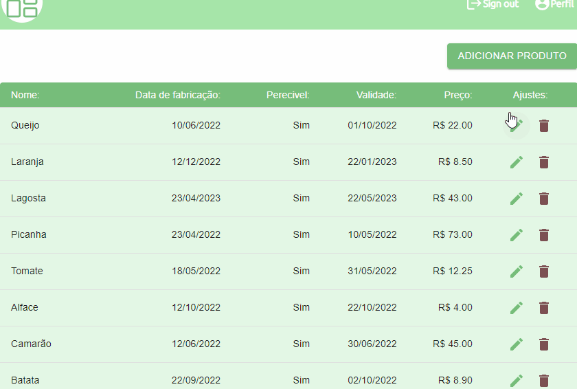
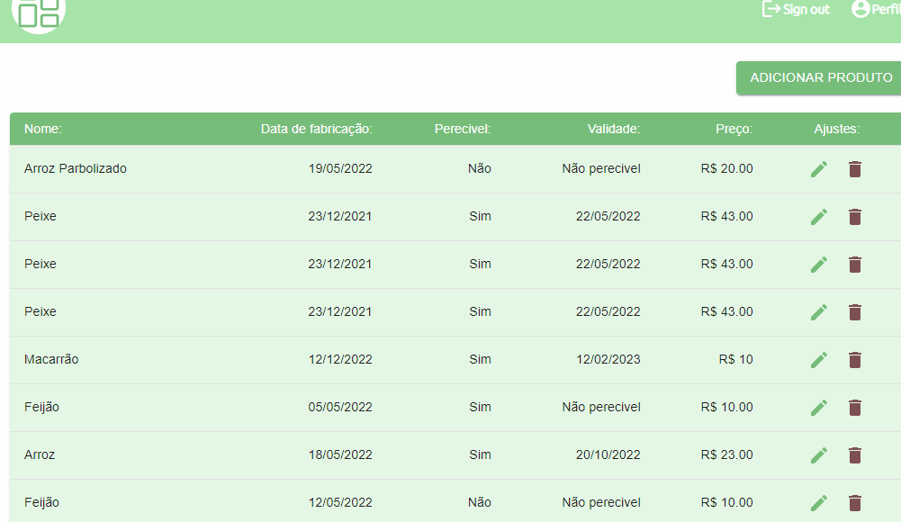

<h1 align="center">
  
HOX

</h1>

<h2>
Description :memo:<h2>

 
Hox Dashboard is a project made to control products, being able to edit, delete and add 

<h4 align="center"> 
    :white_check_mark:Finished Project:white_check_mark:
</h4>

## :hammer: Project features:

- `Functionality 1`:

<h1 align="center"> 

</h1>

- `Functionality 2`:

<h1 align="center"> 

</h1>

- `Functionality 3`:
<h1 align="center"> 

</h1>

## ✔️ Técnicas e tecnologias utilizadas

- `Reactjs`
- `Redux`
- `TypeScript`
- `Json`
