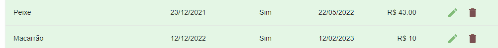
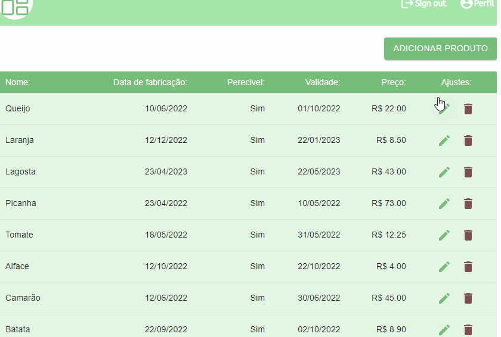

<h1 align="center">
  
HOX

</h1>

<h2>
Description :memo:<h2>

 
Hox Dashboard is a project made to control products, being able to edit, delete and add 

<h4 align="center"> 
    :white_check_mark:Finished Project:white_check_mark:
</h4>

## :hammer: Project features:

- `Functionality 1`:
- [x] Product registration

- `Functionality 1`:
- [x] Product registration

<h1 align="center"> 

</h1>

- `Functionality 2`:
- [x] Product editing

<h1 align="center"> 

</h1>

- `Functionality 3`:
- [x] Delete product

<h1 align="center"> 

</h1>

## ✔️ Login
  ### Comments:
  
To fetch the data in the BackEnd

   
Log in with the details below

<strong>Use email</strong>: admin@gmail.com  
<strong>Use password </strong>: admin123

<h1 align="center"> 

</h1>

# Prerequisites

## Before starting, you will need to have the following tools installed on your machine::

[Git](https://git-scm.com),
[VSCode](https://code.visualstudio.com/).

### 🎲 Running the project

## Clone this repository

$ git clone https://github.com/WendellMoreiraa/hox

# Access the project folder in terminal/cmd

$ cd hox

## install the dependencies

$ yarn install

## Run json-server

$ json-server --watch db.json

## Run the application

$ yarn start

## The server will start on port: 3001 - access: http://localhost:3001

# ✔️ Techniques and technologies used

- `Reactjs`
- `Redux`
- `TypeScript`
- `Json`

---

## Autor

---

<a href="https://github.com/WendellMoreiraa">

  
 <b>Wendell Moreira</b> </a>

