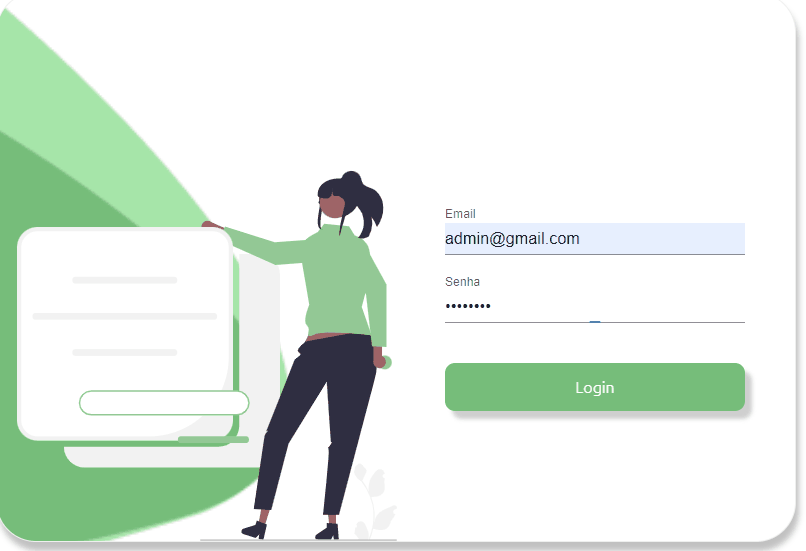

<h1 align="center">
  
HOX

</h1>

<h2>
Description :memo:<h2>

 
Hox Dashboard is a project made to control products, being able to edit, delete and add 

<h4 align="center"> 
    :white_check_mark:Finished Project:white_check_mark:
</h4>

## :hammer: Project features:

 - `Functionality 1`:
 - [x] Product registration
  
  <h1 align="center"> 
  
  </h1>

- `Functionality 2`:
- [x] Product editing

<h1 align="center"> 

</h1>

- `Functionality 3`:
- [x] Delete product
<h1 align="center"> 

</h1>

## ✔️ Login

<strong>Use email</strong>: admin@gmail.com  
<strong>Use password </strong>: admin123

<h1 align="center"> 

</h1>

# Pré-requisitos

## Antes de começar, você vai precisar ter instalado em sua máquina as seguintes ferramentas:

[Git](https://git-scm.com),
[VSCode](https://code.visualstudio.com/).

### 🎲 Rodando o Projeto

## Clone este repositório

$ git clone https://github.com/WendellMoreiraa/hox

# Acesse a pasta do projeto no terminal/cmd

$ cd hox

## Instale as dependências

$ yarn install

## Execute o Json-server

$ json-server --watch db.json

## Execute a aplicação

$ yarn start

## O servidor inciará na porta: 3001 - acesse: http://localhost:3001

# ✔️ Técnicas e tecnologias utilizadas

- `Reactjs`
- `Redux`
- `TypeScript`
- `Json`

---

## Autor

---

<a href="https://github.com/WendellMoreiraa">
 
  
 <b>Wendell Moreira</b> 

